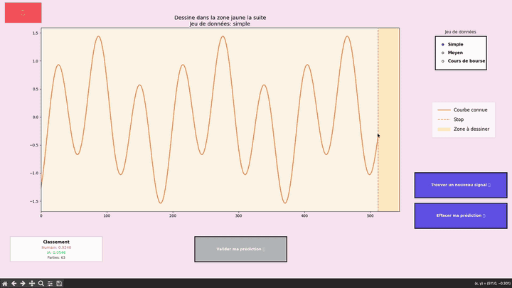

# 🎯 Jeu – Fête de la Science 2025 (Rouen)

## 🧠 Prédiction de signaux : Humain vs IA

Ce jeu interactif met en compétition les **humains** et une **IA** dans la prédiction de signaux temporels.  
L’objectif : comparer les performances humaines à celles d’un modèle de fondation.

---

## 🎬 Demo en vidéo




## ⚙️ Modèle de fondation utilisé

**PatchFM** — un modèle basé sur les Transformers pour la prédiction de séries temporelles.  
🔗 [Accéder au dépôt GitHub PatchFM](https://github.com/vilhess/PatchFM)

---

## 🚀 Installation et exécution

### 1. Création d’un environnement virtuel (si nécessaire)
```bash
python -m venv jds
```

### 2. Activation de l’environnement
```bash
source jds/bin/activate
```

### 3. Installation des dépendances
```bash
pip install -r requirements.txt
```

### 4. Lancement du jeu
```bash
python draw.py
```

### 5. Désactivation de l’environnement
```bash
deactivate
```

---

## 🧩 Description rapide du jeu

- L’utilisateur observe une **série temporelle**.  
- Il doit **prédire la suite de la série** aussi précisément que possible.  
- L’IA réalise la même tâche à l’aide du modèle **PatchFM**.  
- Les performances des deux sont comparées et affichées en temps réel.

---

## 👨‍💻 Auteurs

Projet développé dans le cadre de la **Fête de la Science 2025** à Rouen.  
Conception : **Vilhes Samy-Melwan** – [PatchFM](https://github.com/vilhess/PatchFM)
